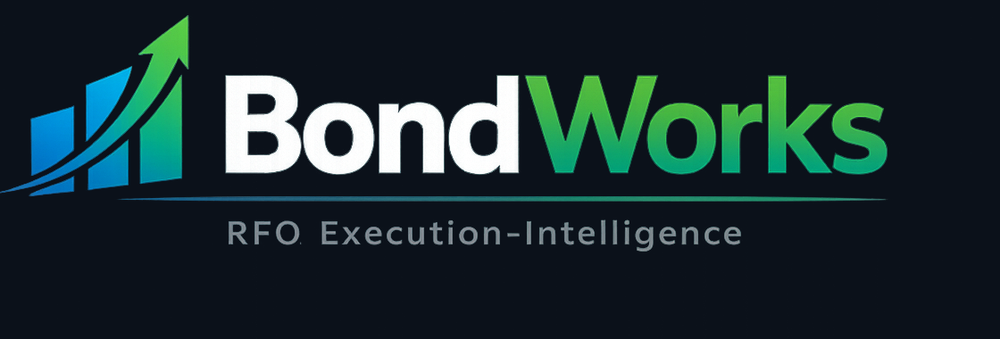
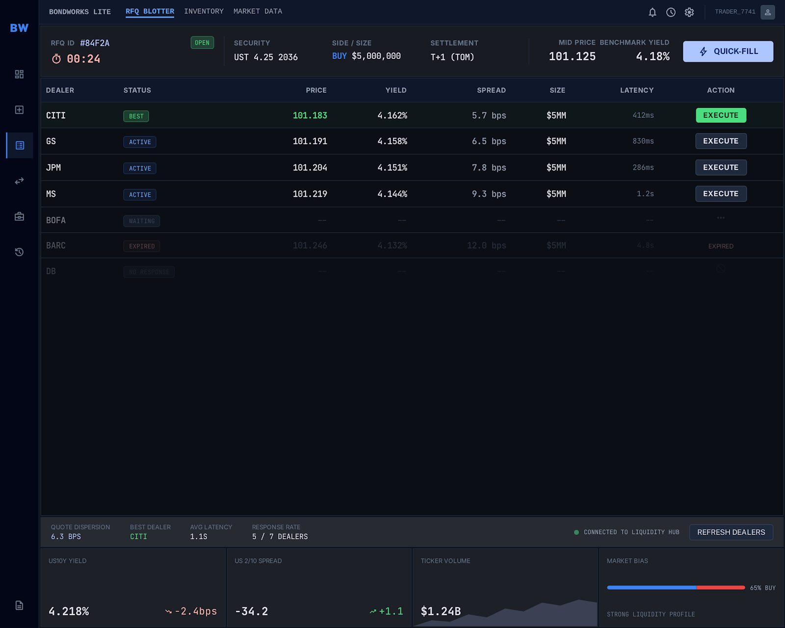
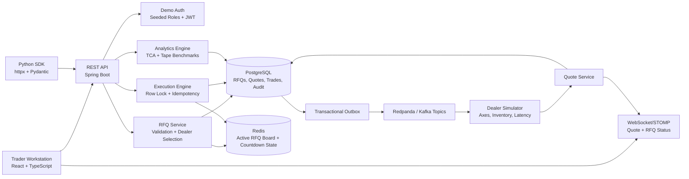

<p align="center">
  
</p>

<h1 align="center">BondWorks Lite</h1>

<p align="center">
  Fixed-income RFQ execution workstation for simulated dealer liquidity, best-execution analytics, and audit-ready trade lifecycle infrastructure.
</p>

<p align="center">
  <a href="https://github.com/Taz33m/BondWorks/actions/workflows/ci.yml">
    
  </a>
  
  
  
  <a href="LICENSE">
    
  </a>
</p>

<p align="center">
  <a href="https://youtu.be/SVm1ZUcQQw4">
    
  </a>
  <a href="docs/architecture.md">
    
  </a>
  <a href="docs/api.md">
    
  </a>
</p>

<p align="center">
  <a href="https://youtu.be/SVm1ZUcQQw4">
    
  </a>
</p>

## Overview

BondWorks Lite is a local-first institutional bond trading simulator. It recreates the decision environment of a buy-side fixed-income RFQ desk: select dealers, request liquidity, compare real-time quotes, execute a trade, and produce post-trade evidence for best execution and compliance review.

The project is intentionally not a generic admin dashboard. The product is built around one core workflow:

`Dealer Selection -> Quote Competition -> Execution Decision -> Best-Execution Proof -> Audit Trail`

## Visual Tour

The screenshot set in [docs/screenshots](docs/screenshots) is ordered around the recruiter demo path:

1. [New RFQ ticket](docs/screenshots/01-new-rfq-ticket.png): dealer selection intelligence, axes, market tape, and RFQ setup.
2. [Live RFQ blotter](docs/screenshots/02-live-rfq-blotter.png): progressive dealer liquidity, latency, spread, and execution controls.
3. [Trade analytics](docs/screenshots/03-trade-analytics.png): quote rank, cover price, slippage, tape VWAP, and audit timeline.
4. [Audit log](docs/screenshots/04-audit-log.png): compliance-oriented event search and lifecycle traceability.
5. [Dealer performance](docs/screenshots/05-dealer-performance.png): counterparty win rate, spread, latency, and RFQ response quality.

## Core Capabilities

- Dealer selection intelligence using deterministic counterparty scores.
- Simulated dealer axes and inventory fit to explain quote quality.
- Live RFQ blotter with progressive dealer quote updates.
- WebSocket/STOMP quote streaming for real-time RFQ state.
- Robust execution path with row locking, idempotency keys, and one-trade-per-RFQ enforcement.
- Best-execution rationale capture when a trader selects a non-best quote.
- Transaction-cost analytics: cover price, quote rank, slippage, spread paid, missed savings, last print, and simulated tape VWAP.
- PostgreSQL audit log for RFQ, quote, execution, rationale, trade, and analytics lifecycle events.
- Minimal Python SDK for systematic RFQ submission and execute-best workflows.

## Technical Architecture



## Stack

- Backend: Java 21, Spring Boot, PostgreSQL, Redis, Redpanda-compatible Kafka, Flyway.
- Frontend: React, TypeScript, Vite, WebSocket/STOMP client, workstation-style CSS.
- SDK: Python, httpx, Pydantic.
- DevOps: Docker Compose, seeded demo data, local-first development.
- Video: HyperFrames HTML composition with generated voiceover, subtitles, and rendered MP4.

## Data Strategy

BondWorks uses a three-layer data model:

- Public market context: Treasury curve and reference rates.
- Real-ish benchmarks: simulated TRACE-like market prints for last-print and tape VWAP analytics.
- Simulated proprietary microstructure: dealer quotes, axes, inventory fit, latency, response rates, and best-execution rationale history.

The backend owns all official trade state and numeric calculations. Simulated and generated data is used only to recreate the decision environment of an RFQ desk.

See [docs/data-strategy.md](docs/data-strategy.md) and [data/README.md](data/README.md).

## Running Locally

Prerequisites:

- JDK 21
- Docker Desktop or Docker CLI
- Node 20+
- Python 3.10+

```bash
git clone https://github.com/Taz33m/BondWorks.git
cd BondWorks
cp .env.example .env
docker compose up --build
```

Local services:

- Frontend: http://localhost:5173
- Backend: http://localhost:8080
- Redpanda Console: http://localhost:8081

## Demo Mode Auth

BondWorks uses seeded demo sessions, not production auth.

- Continue as Trader
- Continue as Dealer
- Continue as Admin

There is no signup, password reset, OAuth, SSO, email verification, or user management in the MVP.

## Demo Workflow

1. Open the New RFQ ticket.
2. Select `UST 4.25 2036`, `BUY`, `$5,000,000`, seven dealers, and `30s` time in force.
3. Submit the RFQ and watch dealer quotes arrive in the Live RFQ Blotter.
4. Execute the best quote, or select a non-best quote to trigger best-execution rationale capture.
5. Review trade analytics: selected rank, cover price, cover distance, slippage, missed savings, and tape VWAP.
6. Open the audit log to verify lifecycle traceability.

## API Surface

Key endpoints:

- `POST /api/auth/demo-login`
- `GET /api/bonds`
- `GET /api/dealers`
- `POST /api/rfqs`
- `GET /api/rfqs/{id}`
- `GET /api/rfqs/{id}/quotes`
- `POST /api/rfqs/{id}/execute`
- `GET /api/trades/{id}/analytics`
- `GET /api/audit-events`
- `GET /api/dealers/performance`

WebSocket topics:

- `/topic/rfqs/{rfqId}/quotes`
- `/topic/rfqs/{rfqId}/status`

See [docs/api.md](docs/api.md).

## Python SDK

```python
from bondworks import Client

client = Client(api_key="demo-bondworks-local-key")

rfq = client.create_rfq(
    bond_code="UST-10Y-2036",
    side="BUY",
    quantity=5_000_000,
    dealers=["CITI", "JPM", "GS", "MS", "BOFA", "BARC", "DB"],
)

quotes = client.wait_for_quotes(rfq.id, timeout=5, min_quotes=5)
best_quote = quotes.best_by_price(rfq.side)
trade = client.execute_quote(rfq.id, best_quote.id)
report = client.get_execution_report(trade.trade_id)

print(report.slippage_bps)
```

## Documentation

- [Architecture](docs/architecture.md)
- [API Reference](docs/api.md)
- [Data Model](docs/data-model.md)
- [Data Strategy](docs/data-strategy.md)
- [Demo Script](docs/demo-script.md)

## Project Status

BondWorks Lite is an MVP portfolio project focused on the highest-signal RFQ lifecycle:

`RFQ creation -> live dealer quotes -> execution -> analytics -> audit`

Future work includes richer market simulation, historical execution-quality dashboards, portfolio/list RFQs, FIX-like protocol modeling, and market-data replay.
