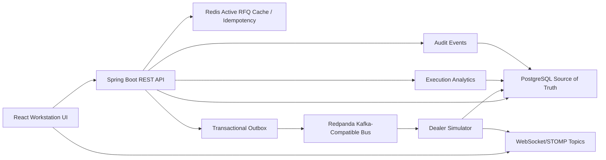

# Architecture

```mermaid
flowchart LR
  UI["React Workstation UI"] --> REST["Spring Boot REST API"]
  UI --> WS["WebSocket/STOMP Topics"]
  REST --> PG["PostgreSQL Source of Truth"]
  REST --> REDIS["Redis Active RFQ Cache / Idempotency"]
  REST --> OUTBOX["Transactional Outbox"]
  OUTBOX --> RP["Redpanda Kafka-Compatible Bus"]
  RP --> DEALER["Dealer Simulator"]
  DEALER --> PG
  DEALER --> WS
  REST --> ANALYTICS["Execution Analytics"]
  ANALYTICS --> PG
  REST --> AUDIT["Audit Events"]
  AUDIT --> PG
```

The development path keeps momentum: RFQ REST and simple quote simulation first, then live WebSocket, execution, analytics, audit, and finally outbox/Redpanda integration.
